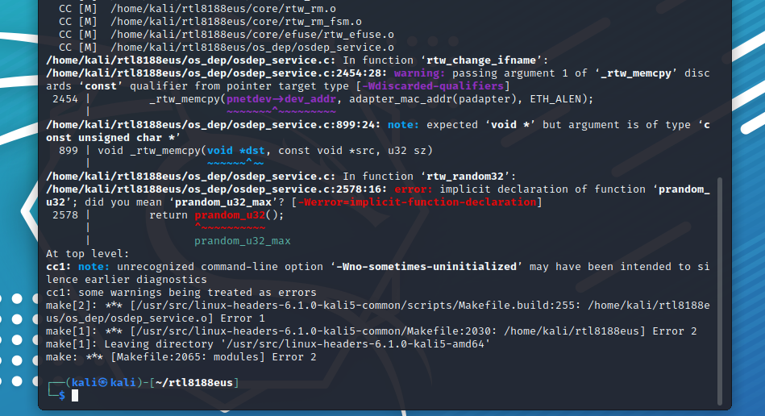

# ***How to Enable Monitor Mode on TP-LINK TL-WN722N V2/V3(for 6.1.x kernals)***
#### In this tutorial we’ll enable monitor mode on a TP-LINK TL-WN722N V2/V3 wireless adapter, on a Kali Linux machine running on VMware or VirtualBox with kernal 6.1.x.

#### Some sources may be unclear and lead you to believe that you can only enable monitor mode on the TP-LINK TL-WN722N v1 because it includes one of the necessary chipsets for monitor mode, Atheros AR9271, and that you cannot enable it on the V2/V3 models. But, you can.

#### If you're using a virtual machine, you must first connect your wifi adapter to the Kali Linux virtual machine before you can proceed.

*****After the recent major upgrade of kali linux, most are finding it difficult to enable monitor mode on TP-LINK TL-WN722N V2/V3 again resulting with the following error while setting it up for monitor mode using the previous method*****



*****But now we have a solution for it*****
## Let's setup the adapter
**Now, we'll run the commands to setup the adapter**
#### Update and upgrade your package index
```bash
sudo apt update && sudo apt upgrade
```
#### Reboot system
```bash
sudo reboot
```
#### Install Kali Linux headers for your Kali Linux
```bash
sudo apt install linux-headers-$(uname -r)
```
#### Install the `bc` package
```bash
sudo apt install bc
```
#### Remove `r8188eu.ko` module
```bash
sudo rmmod r8188eu.ko
```
#### Use the [ gglluukk ](https://github.com/gglluukk/rtl8188eus)Github repository to clone the Realtek driver.
```bash
git clone https://github.com/gglluukk/rtl8188eus
```
#### Change current directory to the cloned `rtl8188eus` directory
```bash
cd rtl8188eus
```
#### Blacklist `r8188eu` by executing following commands one by one 
```bash
sudo -i
echo "blacklist r8188eu" > "/etc/modprobe.d/realtek.conf"
exit
```
#### Reboot system
```bash
reboot
```
#### After reboot run the folllowing commands(we have to change the current directory to the `rtl8188eus` that we cloned earlier)
#### Run the following commands in this order
```bash
cd rtl8188eus
make
sudo make install
sudo modprobe 8188eu
reboot
```
In the above commands the '`modprobe`' command is used to manually load a module into the kernal

## Enable monitor mode
#### After reboot let us try enabling the adapter in monitor mode
#### Run the following commands in the order:
```bash
sudo ifconfig wlan0 down
sudo airmon-ng check kill
sudo iwconfig wlan0 mode monitor
sudo ifconfig wlan0 up
sudo iwconfig
```
#### Here's the output you should be seeing.
**Note that the adapter is set to `Mode: Monitor`**

## ****Support****
***For support, you can [buy me a cofee ☕](https://www.buymeacoffee.com/programandlinux)***
## ****🔗 Links****
[](https://www.youtube.com/channel/UCXcA-zOS4fOa0pMnYLzPACw)
